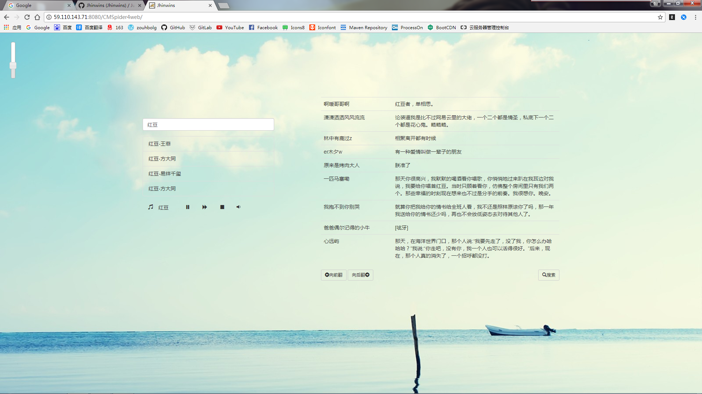
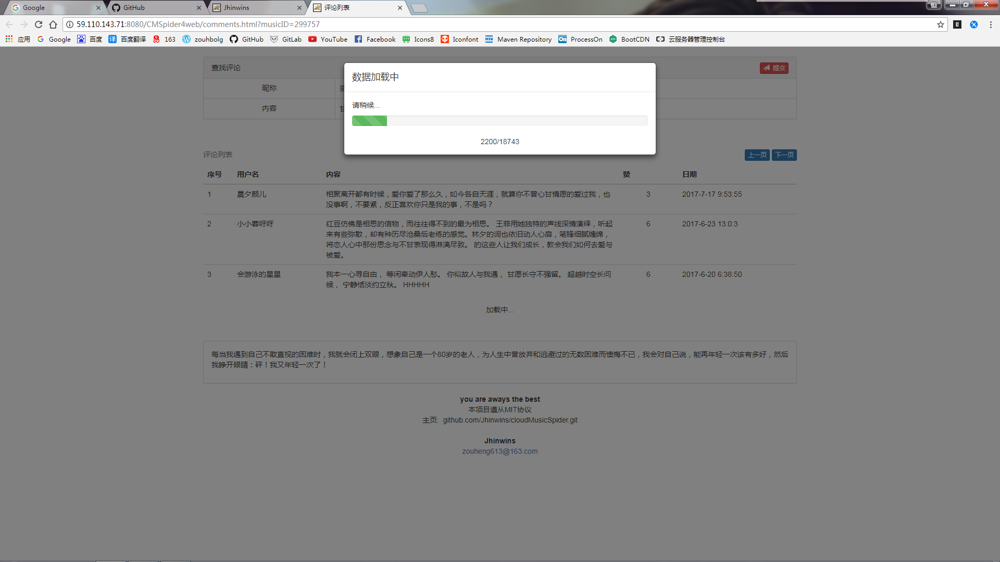
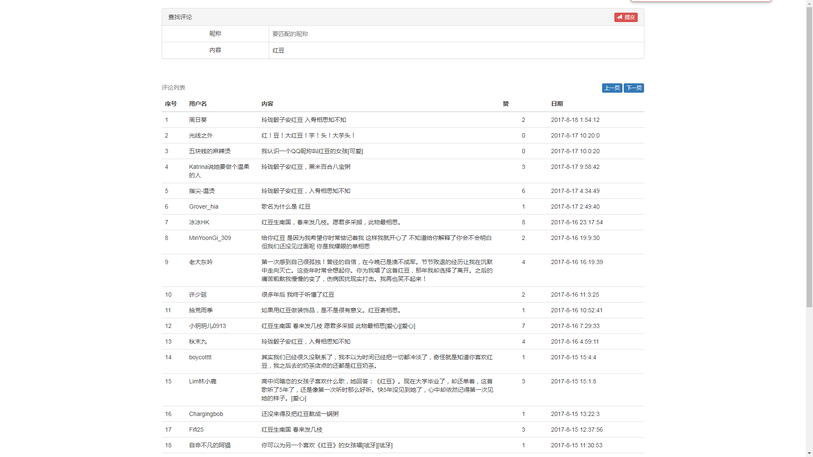

## [网易云音乐的爬虫]

[]()<br/>
>Docker Pull Command:<br/>
>docker pull jhinwins/cmspider4web

可以根据用户名和评论内容进行评论的模糊搜索<br/>
注：
- 本项目依赖我的另一个项目 proxyIp 用以提供稳定可用的代理ip服务
- 如果您急需使用该服务却发现总是显示**网络错误**，原因是代理ip用完了（大概每20分钟加载一次代理ip），您可以运行proxyIp项目Application类中的main方法临时加载代理ip，**并且我们鼓励这么做**<br/>

### 效果演示
<small color=gray>注：由于免费的代理ip很不稳定，且存由于在抓取频率过高导致ip被限制的情况，**所以有时候评论可能刷不出来**，如果您有什么好的建议欢迎告知 zouheng613@163.com</small><br/>
<br/>
<br/>
<br/>


### 安装部署
#### docker 安装
1. 安装 docker,docker-compose

```
# 安装docker
yum install docker -Y
# 启动 docker
sudo systemctl start docker

# 安装 docker-compose
sudo curl -L https://github.com/docker/compose/releases/download/1.16.1/docker-compose-`uname -s`-`uname -m` -o /usr/local/bin/docker-compose
sudo chmod +x /usr/local/bin/docker-compose
```

2. 安装项目

克隆代码

```
git https://github.com/Jhinwins/cloudMusicSpider.git
cd docker
```

一键安装

```
sh deploy.sh

```